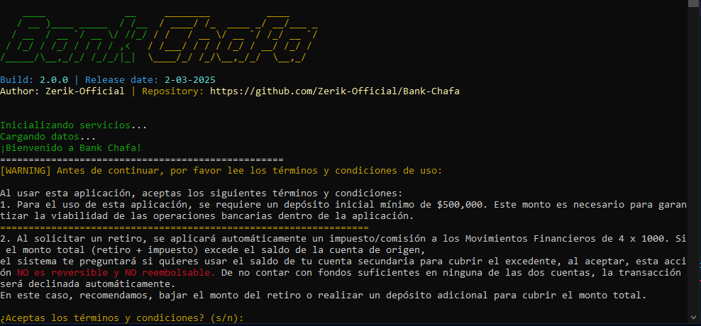

# Bank Chafa

Bank Chafa es un sistema de gestión bancaria modular desarrollado en Python. Esta aplicación permite la administración de múltiples cuentas, transferencias interbancarias y cálculos automáticos de impuestos gubernamentales (4x1000), utilizando una arquitectura de servicios separada de la lógica de interfaz. 

<p align="center">
   
</p>

## ¿Dato curioso?
> Duración de la creación: 12 horas aprox
> Desde el 1 de mayo a las 8 A.M hasta el 2 de mayo hasta las 12:02 A.M
> Ya casi voy a dormir!

## Requisitos

- Python 3.8 o superior
- Librería `colorama` para colorear la salida en la terminal

## Instalación

1. Crear un entorno virtual (venv) en la raíz del proyecto:
   ```bash
   python3 -m venv venv
   ```
2. Activar el entorno virtual:
   - En macOS/Linux:
     ```bash
     source venv/bin/activate
     ```
   - En Windows (PowerShell):
     ```powershell
     .\venv\Scripts\Activate.ps1
     ```
3. Instalar dependencias:
   ```bash
   pip install colorama
   ```

## Uso

Una vez configurado el entorno virtual e instalada la dependencia, ejecutar el script principal:

```bash
python main.py
```
si te dá un error, ejecuta:
```bash
python3 main.py
```

Sigue las indicaciones del programa, danos tu dinero! y disfruta :)

### By Zerik
> Version 2.0
> Gustavo Andrés Guzmán Mejía